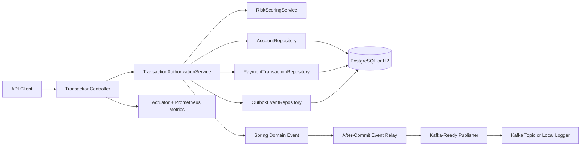

# TransactGuard

[](https://github.com/kunju004/transactguard/actions/workflows/ci.yml)


TransactGuard is a payment-risk authorization microservice built to demonstrate production-style Java backend engineering: REST APIs, Spring Boot, JPA/Hibernate persistence, transactional idempotency, account locking, outbox-backed event publication, CI, tests, metrics, and operational readiness.

It models the kind of backend service used by a marketplace, fintech, or payment platform to decide whether a tokenized transaction should be approved, declined, or sent for review.

## Why this project exists

This project is intentionally built like a small production service instead of a tutorial CRUD app. It focuses on design decisions that are common in high-throughput transaction systems:

- idempotent authorization requests to handle retries safely
- account row locking to protect concurrent balance updates
- request validation and secure defaults for tokenized payment inputs
- transactional outbox records to keep database state and event publication consistent
- structured health, metrics, and API documentation for operational readiness
- unit and integration tests for business rules, validation, persistence, and API behavior

## Architecture



## Tech stack

| Area | Implementation |
| --- | --- |
| Language | Java 21 |
| Framework | Spring Boot 3 |
| API | REST, Jakarta Bean Validation, Swagger/OpenAPI |
| Persistence | Spring Data JPA, Hibernate, H2, PostgreSQL |
| Messaging | Transactional outbox, after-commit relay, Kafka-ready publisher |
| Reliability | idempotency keys, account locking, correlation IDs, health checks |
| Observability | Spring Boot Actuator, Micrometer, Prometheus, Grafana config |
| Testing | JUnit 5, AssertJ, MockMvc, Spring Boot integration tests |
| Delivery | Docker, Docker Compose, GitHub Actions |

## Core features

### Payment authorization API

`POST /api/v1/transactions/authorize` accepts a tokenized transaction request and returns a decision:

- `APPROVED`
- `DECLINED`
- `PENDING_REVIEW`

The response includes transaction ID, status, risk decision, score, reason codes, and timestamps.

### Idempotency and replay safety

TransactGuard hashes client-provided idempotency keys and stores a request fingerprint. If the same key is replayed with the same payload, the service returns the original decision. If the same key is reused with a different payload, the service returns a conflict.

### Concurrency protection

The service uses account-level locking during authorization so concurrent requests cannot corrupt account balances.

### Risk scoring

The risk engine evaluates transaction amount, merchant category, country, account state, and request characteristics to produce explainable reason codes.

### Transactional outbox

Authorization events are persisted to an outbox table in the same transaction as the payment decision. Events are then relayed after commit to a Kafka-ready publisher or local logger.

### Operational readiness

The service exposes:

- `/actuator/health`
- `/actuator/prometheus`
- `/swagger-ui.html`
- `/v3/api-docs`

## Run locally

### Prerequisites

- Java 21
- Maven 3.9+
- Docker and Docker Compose for full-stack mode

### H2/local mode

```bash
mvn spring-boot:run
```

### Run tests

```bash
mvn verify
```

### Docker verification without local Maven

```bash
docker run --rm -v "$PWD":/workspace -w /workspace maven:3.9.9-eclipse-temurin-21 mvn verify
```

### Full stack with PostgreSQL, Kafka, Prometheus, and Grafana

```bash
docker compose up --build
```

Service URLs:

| Service | URL |
| --- | --- |
| API | http://localhost:8080 |
| Swagger UI | http://localhost:8080/swagger-ui.html |
| Health | http://localhost:8080/actuator/health |
| Prometheus metrics | http://localhost:8080/actuator/prometheus |
| Prometheus | http://localhost:9090 |
| Grafana | http://localhost:3000 |

Grafana default login:

```text
admin / admin
```

## Example authorization request

```bash
curl -i -X POST http://localhost:8080/api/v1/transactions/authorize \
  -H "Content-Type: application/json" \
  -H "X-Correlation-Id: demo-request-001" \
  -d '{
    "accountId": "acct_market_001",
    "cardToken": "tok_urbanRoast0001",
    "merchantId": "merchant_urban_roast",
    "merchantCategoryCode": "5812",
    "merchantCountry": "US",
    "currency": "USD",
    "amount": 42.25,
    "idempotencyKey": "idem-demo-0001"
  }'
```

Replay the same request with the same idempotency key to demonstrate replay-safe behavior.

## API surface

| Method | Endpoint | Purpose |
| --- | --- | --- |
| POST | `/api/v1/transactions/authorize` | Authorize, decline, or route a transaction for review |
| GET | `/api/v1/transactions/{transactionId}` | Retrieve one transaction decision |
| GET | `/api/v1/accounts/{accountId}/transactions` | List recent account transactions |
| GET | `/actuator/health` | Service health |
| GET | `/actuator/prometheus` | Prometheus metrics |

## Demo script

A recruiter or hiring manager can evaluate the project in under five minutes:

1. Run `docker compose up --build`.
2. Open `http://localhost:8080/swagger-ui.html`.
3. Submit the example authorization request.
4. Submit it again to show idempotency.
5. Run `mvn verify` or the Docker Maven command to show tests.
6. Open `http://localhost:9090` for Prometheus and `http://localhost:3000` for Grafana.

## Engineering decisions

- **JPA row locking:** protects balance updates during concurrent authorization requests.
- **Idempotency hashing:** prevents duplicate processing while avoiding raw idempotency key storage.
- **Request fingerprinting:** detects accidental replay drift for reused keys.
- **Outbox pattern:** keeps database writes and downstream event publication consistent.
- **After-commit relay:** avoids publishing events for rolled-back transactions.
- **Tokenized card input:** rejects raw card numbers and requires `tok_...` payment tokens.
- **Correlation IDs:** make requests traceable across logs and API responses.
- **Actuator and Prometheus:** expose runtime health and metrics for operational visibility.

## Testing strategy

The test suite focuses on business-critical behavior:

- risk scoring decisions and reason codes
- request validation
- transaction authorization API behavior
- persistence and idempotency behavior
- error handling for invalid requests and conflicts

Run:

```bash
mvn verify
```

## Resume bullets

```text
Built a Java 21/Spring Boot payment-risk authorization microservice with REST APIs, Bean Validation, idempotency keys, account locking, and JPA/Hibernate persistence using PostgreSQL and H2 profiles.
Implemented transactional outbox messaging with a Kafka-ready event publisher, after-commit relay, correlation IDs, Docker Compose deployment, and CI validation through GitHub Actions.
Added JUnit/MockMvc test coverage, Swagger/OpenAPI docs, actuator health checks, secure headers, and Prometheus metrics for validation, persistence, idempotency, and API behavior.
```

## Repository quality checklist

- [x] Spring Boot layered architecture
- [x] REST API and OpenAPI documentation
- [x] JPA/Hibernate persistence
- [x] idempotency and account locking
- [x] transactional outbox
- [x] Kafka-ready publisher
- [x] unit and integration tests
- [x] Dockerfile and Docker Compose
- [x] GitHub Actions CI
- [x] Prometheus and Grafana configuration

## License

MIT License. See [LICENSE](LICENSE).
